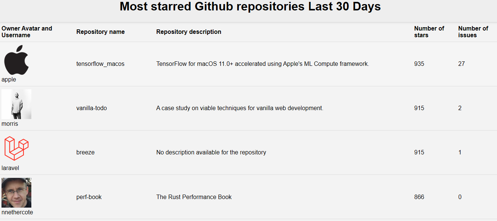

# The Most Starred Github Repos Project

 

---
### Table of Contents
- [Description](#description)
- [How to Use](#how-to-use)
- [Contributors](#contributors)
- [Reference](#references)
- [License](#license)
- [Author Info](#author-info)

---
## Description
This project use Github API to display the most starred Github repositories for the last 30 days, and gives the ability to keep scrolling ( Pagination feature) through the starred repositories in this period of time.

### Technologies
- Javascript : Easy to debug, Relatively fast for the end user.
- HTML .
- CSS .
- Github API.
- Markdown : used in the Readme file.

---
## How to use

### Installation

- Download the project , and just click the index.html file to open up the web application in the Browser (need internet connection to work).

### Usage
- Open up the index.html file in the browser ,and then you can see all the starred repositories details .

---
## Contributors

- Habib Fouad < hello_hi10@hotmail.com>

---
## Reference
- [Github API Repositories Documentation](https://developer.github.com/v3/search/#search-repositories)

---
## License

MIT License

Copyright (c) 2017 Andrew Fong.

Permission is hereby granted, free of charge, to any person obtaining a copy of this software and associated documentation files (the "Software"), to deal in the Software without restriction, including without limitation the rights to use, copy, modify, merge, publish, distribute, sublicense, and/or sell copies of the Software, and to permit persons to whom the Software is furnished to do so, subject to the following conditions:

The above copyright notice and this permission notice shall be included in all copies or substantial portions of the Software.

THE SOFTWARE IS PROVIDED "AS IS", WITHOUT WARRANTY OF ANY KIND, EXPRESS OR IMPLIED, INCLUDING BUT NOT LIMITED TO THE WARRANTIES OF MERCHANTABILITY, FITNESS FOR A PARTICULAR PURPOSE AND NONINFRINGEMENT. IN NO EVENT SHALL THE AUTHORS OR COPYRIGHT HOLDERS BE LIABLE FOR ANY CLAIM, DAMAGES OR OTHER LIABILITY, WHETHER IN AN ACTION OF CONTRACT, TORT OR OTHERWISE, ARISING FROM, OUT OF OR IN CONNECTION WITH THE SOFTWARE OR THE USE OR OTHER DEALINGS IN THE SOFTWARE.

---
## Author Info

- Linkedin [Habib Fouad](https://www.linkedin.com/in/fouad-habib-2a0294139/)
- Email : habibfouad@hotmail.fr
